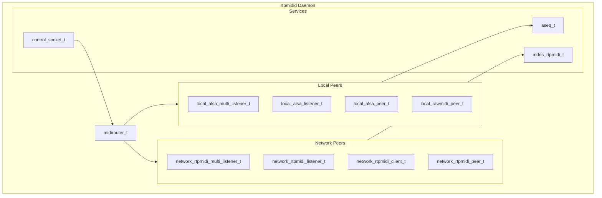
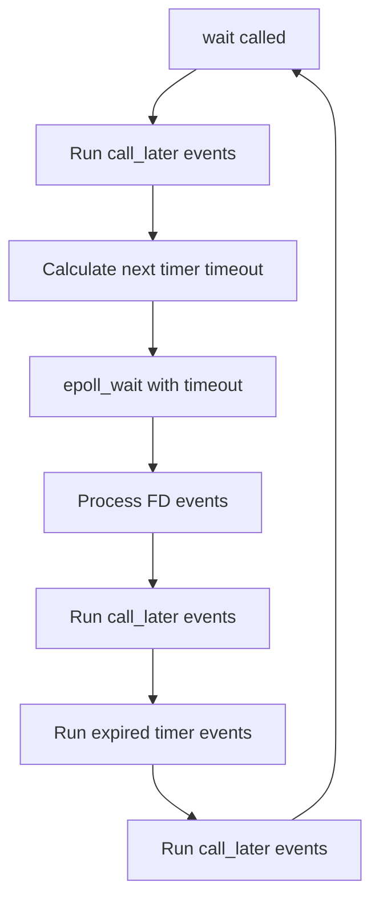
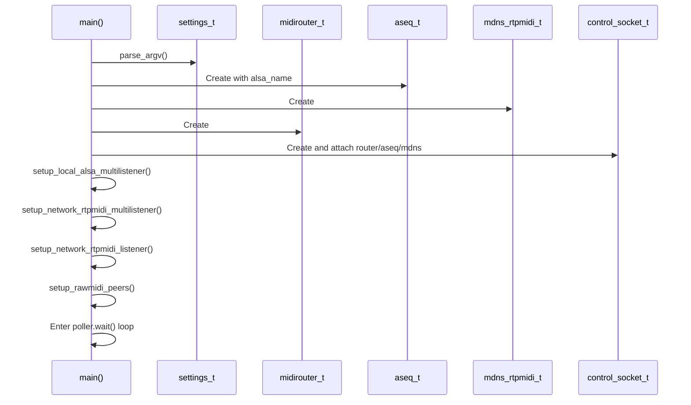
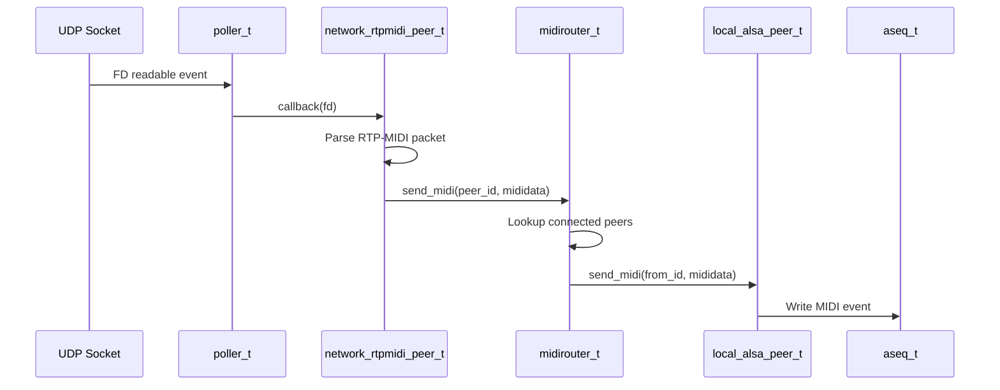
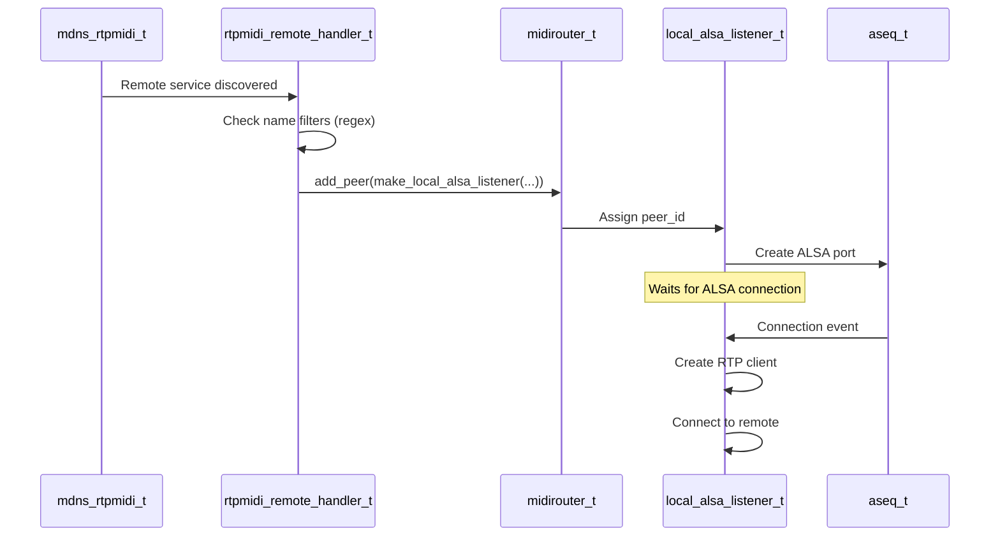

# AGENTS.md - rtpmidid Developer Reference

This document provides comprehensive technical documentation for developers working on or with the rtpmidid codebase. It covers architecture, internals, configuration, and development guidelines.

## Table of Contents

1. [Overview](#overview)
2. [Architecture](#architecture)
3. [Main Event Loop](#main-event-loop)
4. [Core Components](#core-components)
5. [Component Interactions](#component-interactions)
6. [Configuration System](#configuration-system)
7. [Control Socket](#control-socket)
8. [Testing and Development](#testing-and-development)
9. [Logging System](#logging-system)
10. [Future Development Notes](#future-development-notes)

---

## Overview

**rtpmidid** (Real Time Protocol Musical Instrument Digital Interface Daemon) is a userspace daemon that bridges ALSA MIDI sequencer devices with network RTP-MIDI endpoints. It enables:

- **Exporting local ALSA MIDI devices** to the network via RTP-MIDI protocol
- **Importing remote RTP-MIDI devices** as local ALSA sequencer ports
- **Automatic discovery** of network MIDI devices via mDNS (Zeroconf/Avahi/Bonjour)
- **Direct connections** to specific IP:port endpoints
- **Raw MIDI device integration** - Connect directly to `/dev/snd/midiC*D*` devices, FIFOs, or serial ports

The project consists of two parts:
- **librtpmidid** (LGPL 2.1): Core RTP-MIDI protocol library in `lib/` and `include/rtpmidid/`
- **rtpmidid daemon** (GPLv3): The daemon application in `src/`

Key source files:
- `src/main.cpp` - Application entry point and main loop
- `src/midirouter.cpp` - Central MIDI routing logic
- `src/midipeer.cpp` - Base peer interface
- `lib/poller.cpp` - Event loop implementation
- `lib/dns_resolver.cpp` - Async `getaddrinfo` worker + eventfd wakeup
- `lib/rtppeer.cpp` - RTP-MIDI peer protocol

---

## Architecture

The architecture follows a **peer-router pattern** where all MIDI sources and sinks are represented as `midipeer_t` instances, connected through a central `midirouter_t`.



### Design Principles

1. **Peer Abstraction**: Every MIDI endpoint (ALSA port, network connection, raw device) is a `midipeer_t`
2. **Unidirectional Connections**: Router connections are one-way; bidirectional requires two connections
3. **Event-Driven**: All I/O is non-blocking, using epoll for multiplexing
4. **Factory Pattern**: Peer creation is centralized in `factory.cpp` for consistency and testability
5. **Shared Ownership**: Peers are managed via `std::shared_ptr` with the router holding references

### Peer Types

| Type | Description | File |
|------|-------------|------|
| `local_alsa_multi_listener_t` | ALSA "Network" port that creates RTP servers per connection | `local_alsa_multi_listener.cpp` |
| `local_alsa_listener_t` | ALSA port that connects to a remote RTP server on connection | `local_alsa_listener.cpp` |
| `local_alsa_peer_t` | Simple ALSA port for MIDI routing | `local_alsa_peer.cpp` |
| `local_rawmidi_peer_t` | Raw MIDI device (e.g., `/dev/snd/midiC0D0`) | `local_rawmidi_peer.cpp` |
| `network_rtpmidi_multi_listener_t` | RTP server that creates peers per incoming connection | `network_rtpmidi_multi_listener.cpp` |
| `network_rtpmidi_listener_t` | Single RTP server endpoint (announced via mDNS) | `network_rtpmidi_listener.cpp` |
| `network_rtpmidi_client_t` | RTP client connecting to remote server | `network_rtpmidi_client.cpp` |
| `network_rtpmidi_peer_t` | Active RTP connection (server-side) | `network_rtpmidi_peer.cpp` |

---

## Main Event Loop

The daemon is **multi-threaded** with a **Linux epoll** main loop (`rtpmidid::poller`) for real-time I/O. Other work runs on dedicated threads so blocking operations (DNS, control CLI, ALSA drain) do not stall unrelated peers.

### Thread inventory

| Thread | Role | Key files |
|--------|------|-----------|
| **Main / poller** | `epoll_wait`; UDP (`MSG_DONTWAIT`), ALSA sequencer FD, Avahi watches, DNS `eventfd`, `call_later` | `lib/poller.cpp`, `src/main.cpp` |
| **Router** | Consumes `midirouter_t::routing_queue`; dispatches `SEND_MIDI` to peer input queues | `src/midirouter.cpp` |
| **Per peer** | One `std::thread` per `midipeer_t`; runs `send_midi()` (ALSA / network) | `src/midipeer.cpp` |
| **DNS worker** | Blocking `getaddrinfo`; wakes poller via `eventfd` | `lib/dns_resolver.cpp`, `include/rtpmidid/dns_resolver.hpp` |
| **Control socket** | Dedicated thread; `poll()` + blocking `accept`/`recv`/`write` on Unix socket | `src/control_socket.cpp` |
| **Logger** | Drains lock-free log queue | `lib/logger.cpp` |

Shutdown: `main_t::close()` calls `rtpmidid::dns_resolver_shutdown()` **before** stopping router/peer threads so the DNS worker exits cleanly while `poller` is still valid.

### Queues and locking

- **`routing_queue`** (`midirouter.hpp`): lock-free ring buffer documented as SPSC on dequeue; **multiple producers** (poller + all peer threads) serialize on `routing_enqueue_mutex` during `enqueue_*`.
- **Per-peer `input_queue`**: true SPSC — producer is the router thread only (`peer_enqueue_fn` → `enqueue_midi_packet`).
- **`peers` map**: `std::shared_mutex` for reads/writes; topology changes from the control socket go through `enqueue_connect` / `enqueue_disconnect` / `enqueue_remove_peer` so they run on the router thread.

### Poller Implementation

The `poller_t` class (`lib/poller.cpp`) is a singleton (`rtpmidid::poller`) that manages:

1. **File Descriptor Events**: Network sockets, ALSA sequencer, Avahi integration, DNS resolver `eventfd`
2. **Timer Events**: Periodic tasks like CK (clock) messages, connection timeouts
3. **Deferred Execution**: `call_later()` for operations that must run outside current call stack

```cpp
// Main loop structure (src/main.cpp)
while (rtpmidid::poller.is_open()) {
    rtpmidid::poller.wait();
}
```

### Event Loop Cycle



### Key Poller Methods

```cpp
// Add file descriptor for read events
listener_t add_fd_in(int fd, std::function<void(int)> callback);

// Add timer event (one-shot)
timer_t add_timer_event(std::chrono::milliseconds ms, std::function<void()> callback);

// Schedule execution after current event processing
void call_later(std::function<void()> callback);

// Close poller (triggers main loop exit)
void close();
```

### Signal Handling

The daemon handles `SIGINT` and `SIGTERM` by calling `rtpmidid::poller.close()`, which causes `is_open()` to return false and the main loop to exit gracefully.

### Performance Considerations

**Avoid slow work on the poller thread** (UDP/ALSA read paths, timers, Avahi callbacks, DNS completion handlers): that thread drives all RTP timers and network reads.

**Operations to Avoid on the Poller Thread:**
- **Memory allocation** (`malloc`/`free`, `new`/`delete`, `std::vector::push_back` that triggers reallocation)
- **Disk I/O** (file reads/writes, logging to files)
- **Console I/O** (logging to stdout/stderr)
- **Blocking `getaddrinfo`** — use `dns_resolver()` / `resolve_async()` (`lib/rtpclient.cpp`)
- **String operations** that allocate (`std::string` concatenation, `FMT::format` with heap allocation)

**Peer threads** may still hit blocking ALSA (`snd_seq_drain_output`) or full UDP buffers (`MSG_DONTWAIT` + drop on `EAGAIN` in `lib/udppeer.cpp`); that only delays the involved peer’s queue.

**Optional compile-time instrumentation:** `-DRTPMIDID_ENABLE_TIMING=1` (CMake option `RTPMIDID_ENABLE_TIMING`) enables `steady_clock` timestamps on `midi_packet_t` and per-packet timing logs in `process_midi_packet` — off by default for hot-path overhead.

**Best Practices:**
- Use stack-allocated buffers: `io_bytes_writer_static<N>` instead of dynamic allocation
- Pre-allocate containers with `reserve()` if size is known
- Use `mididata_t` as a view (pointers only, no copying)
- Avoid logging in the MIDI data path (use `DEBUG` which compiles out in release)
- Use rate-limited logging for warnings in hot paths: `WARNING_RATE_LIMIT(seconds, ...)`

**Good Example (from `lib/rtppeer.cpp`):**
```cpp
void rtppeer_t::send_midi(const io_bytes_reader &events) {
  io_bytes_writer_static<4096 + 12> buffer;  // Stack-allocated, no malloc
  // ... build packet ...
  send_event(buffer, MIDI_PORT);
}
```

### Areas Potentially Breaking Performance Guidelines

The following areas of the codebase may need review for performance-critical use cases:

1. **`midi_normalizer_t::m_buffer`** (`src/midi_normalizer.cpp`)
   - Uses `std::vector<uint8_t>::push_back()` which may reallocate
   - Constructor calls `reserve(4)` but SysEx messages can be much larger
   - Consider using a fixed-size buffer or ring buffer

2. **`std::function` callbacks** (various files)
   - Passing `std::function` with captures can cause heap allocations
   - Used extensively in `normalize_stream()`, `mididata_to_evs_f()`, `ev_to_mididata_f()`
   - Consider templated callbacks or function pointers for hot paths

3. **Logging in MIDI paths** (various files)
   - `ERROR()` and `WARNING()` calls in `send_midi()` implementations write to stdout
   - Example: `local_alsa_peer.cpp` logs errors on every failed ALSA event
   - Use `ERROR_ONCE()` or `WARNING_RATE_LIMIT()` to reduce I/O

4. **JSON status generation** (`src/midirouter.cpp`)
   - `status()` creates `std::vector<json_t>` with heap allocations
   - Only called from control socket (not hot path), but worth noting

5. **ALSA sequencer output** (`src/local_alsa_peer.cpp`)
   - Uses one `snd_seq_drain_output()` per `send_midi()` batch (after all `snd_seq_event_output` calls) to reduce syscalls; may still block that peer’s thread only

---

## Core Components

### midirouter_t

The central hub that manages all peers and routes MIDI data between them.

**Key responsibilities:**
- Maintains a map of all active peers (`peers` unordered_map)
- Manages peer connections (unidirectional from→to)
- Routes MIDI data from source peers to connected destination peers
- Emits events when connections are made/broken

**Key methods:**
```cpp
peer_id_t add_peer(std::shared_ptr<midipeer_t> peer);
void remove_peer(peer_id_t id);
void connect(peer_id_t from, peer_id_t to);
void disconnect(peer_id_t from, peer_id_t to);
void send_midi(peer_id_t from, const mididata_t& data);
json_t status();  // For control socket
// Thread-safe when router thread is running (used from peer / poller threads):
bool enqueue_send_midi(peer_id_t from, const mididata_t& data);
bool enqueue_connect(peer_id_t from, peer_id_t to);
bool enqueue_disconnect(peer_id_t from, peer_id_t to);
bool enqueue_remove_peer(peer_id_t peer_id);
```

**File:** `src/midirouter.cpp`

### midipeer_t

Abstract base class for all MIDI peers. Each peer has:
- A unique `peer_id` assigned by the router
- Packet statistics (`packets_sent`, `packets_recv`)
- Reference to parent router

**Virtual interface:**
```cpp
virtual json_t status() = 0;                              // Status for control socket
virtual void send_midi(midipeer_id_t from, const mididata_t&) = 0;  // Receive MIDI
virtual void event(midipeer_event_e event, midipeer_id_t from);     // Connection events
virtual json_t command(const std::string& cmd, const json_t& data); // Control commands
virtual const char* get_type() const = 0;                 // Type identifier string
```

**Events:**
- `CONNECTED_ROUTER` / `DISCONNECTED_ROUTER`: Router-level connection changes
- `CONNECTED_PEER` / `DISCONNECTED_PEER`: Network peer connection changes

**File:** `src/midipeer.cpp`

### poller_t

Singleton event loop using epoll. Level-triggered for FD events.

**Internal structure:**
```cpp
struct poller_private_data_t {
    int epollfd;
    std::map<int, std::function<void(int)>> fd_events;
    std::vector<timer_event_t> timer_events;  // Sorted by time
    std::vector<std::function<void()>> later_events;
};
```

**RAII Guards:**
- `listener_t`: Automatically removes FD from epoll on destruction
- `timer_t`: Automatically cancels timer on destruction

**File:** `lib/poller.cpp`, `include/rtpmidid/poller.hpp`

### aseq_t

ALSA sequencer interface. Manages:
- Creating/destroying ALSA sequencer ports
- Reading/writing MIDI events
- Subscribing to ALSA connection events

The ALSA sequencer FD is added to the poller for event-driven I/O.

**File:** `src/aseq.cpp`

### mdns_rtpmidi_t

mDNS service discovery using Avahi. Handles:
- Announcing local RTP-MIDI services
- Discovering remote RTP-MIDI services
- Notifying when services appear/disappear

Remote handler (`rtpmidiremotehandler.cpp`) creates ALSA listener peers for discovered services.

**File:** `lib/mdns_rtpmidi.cpp`

### dns_resolver_t

Async hostname resolution for RTP clients:

- `rtpmidid::dns_resolver().resolve_async(host, port, callback)` queues work on an internal worker thread; `callback`’s first hop runs on the **poller thread** from an `eventfd` read handler (implementations typically use `poller.call_later` to resume `rtpclient_t` state machines).
- `rtpmidid::dns_resolver_shutdown()` joins the worker and removes the `eventfd` from `poller` — call from application shutdown **before** `poller.close()` / static teardown (`src/main.cpp`).

**Files:** `include/rtpmidid/dns_resolver.hpp`, `lib/dns_resolver.cpp`

---

## Component Interactions

### Startup Sequence



### MIDI Data Flow Example

When MIDI data arrives from a network peer and needs to go to ALSA:



### Connection Establishment (mDNS Discovery)



---

## Configuration System

### INI File Format

Configuration is loaded from INI files (default: `/etc/rtpmidid/default.ini`).

#### Sections

**[general]**
```ini
[general]
alsa_name=rtpmidid           # ALSA client name
control=/var/run/rtpmidid/control.sock  # Control socket path
log_level=info               # debug|info|warning|error
```

**[rtpmidi_announce]** (can appear multiple times)
```ini
[rtpmidi_announce]
name={{hostname}}            # Service name ({{hostname}} = system hostname)
port=5004                    # UDP port for RTP-MIDI
```

**[alsa_announce]** (can appear multiple times)
```ini
[alsa_announce]
name=Network Export          # ALSA port name for exporting
```

**[rtpmidi_discover]**
```ini
[rtpmidi_discover]
enabled=true                 # Enable mDNS discovery
name_positive_regex=.*       # Accept services matching this
name_negative_regex=^$       # Reject services matching this (checked first)
```

**[connect_to]** (can appear multiple times)
```ini
[connect_to]
hostname=192.168.1.33
port=5004                    # Default: 5004
name=DeepMind12D
local_udp_port=5010          # Optional: specific local port
```

**[alsa_hw_auto_export]**
```ini
[alsa_hw_auto_export]
name_positive_regex=.*
name_negative_regex=(System|Timer|Announce)
type=hardware                # hardware|software|all|none
```

**[rawmidi]** (can appear multiple times)
```ini
[rawmidi]
name=MIDI Device
device=/dev/snd/midiC4D0
local_udp_port=5104
# For client mode:
# hostname=remote.host
# remote_udp_port=5004
```

### Settings Structure

Settings are parsed into `settings_t` (`src/settings.hpp`):

```cpp
struct settings_t {
    std::string alsa_name;
    std::string control_filename;
    rtpmidid::logger_level_t log_level;
    
    std::vector<rtpmidi_announce_t> rtpmidi_announces;
    rtpmidi_discover_t rtpmidi_discover;
    std::vector<alsa_announce_t> alsa_announces;
    std::vector<connect_to_t> connect_to;
    alsa_hw_auto_export_t alsa_hw_auto_export;
    std::vector<rawmidi_t> rawmidi;
};
```

### Command Line Arguments

```
--ini FILE           Load INI configuration file
--port PORT          Server port (default: 5004)
--name NAME          Set both ALSA and RTP-MIDI name
--alsa-name NAME     Set ALSA client name
--rtpmidid-name NAME Set RTP-MIDI service name
--control PATH       Control socket path
--version            Show version
--help               Show help
```

---

## Control Socket

The daemon exposes a Unix domain socket for runtime control and monitoring.

### Protocol

- **Transport**: Unix domain socket (default: `/var/run/rtpmidid/control.sock`)
- **Format**: Line-delimited JSON
- **Request**: `{"method": "command", "params": [...], "id": 1}`
- **Response**: `{"id": 1, "result": ...}` or `{"id": 1, "error": "..."}`

### Available Commands

| Command | Description | Parameters |
|---------|-------------|------------|
| `status` | Get daemon status, all peers, mDNS state | none |
| `help` | List available commands | none |
| `connect` | Connect to remote RTP-MIDI server | `[hostname]`, `[hostname, port]`, or `[name, hostname, port]` |
| `router.remove` | Remove a peer | `[peer_id]` |
| `router.connect` | Connect two peers | `{"from": id, "to": id}` |
| `router.disconnect` | Disconnect two peers | `{"from": id, "to": id}` |
| `router.create` | Create a new peer | `{"type": "...", ...}` |
| `mdns.remove` | Remove mDNS announcement | `{"name": "...", "port": ...}` |
| `export.rawmidi` | Export raw MIDI device | `{"device": "...", ...}` |
| `{peer_id}.{cmd}` | Send command to specific peer | varies |

### Peer-Specific Commands

Commands can be sent to individual peers using the format `{peer_id}.{command}`:

```json
{"method": "5.status", "params": {}, "id": 1}
```

### Async Events

The server may send unsolicited events:

```json
{"event": "close", "detail": "Shutdown", "code": 0}
```

### CLI Usage

```bash
# Using the CLI tool
cli/rtpmidid-cli.py status
cli/rtpmidid-cli.py connect MySynth 192.168.1.100 5004

# Multiple commands (separated by .)
cli/rtpmidid-cli.py help . status

# Using netcat directly
echo '{"method":"status","id":1}' | nc -U /var/run/rtpmidid/control.sock
```

### Implementation Details

The control socket implementation is in `src/control_socket.cpp`:

1. A **dedicated server thread** runs `poll()` on the listening Unix socket and all accepted client FDs (blocking I/O is OK here — it does not run on the epoll/MIDI poller thread).
2. JSON commands are parsed and dispatched to the same handler table as before; `router.connect` / `router.disconnect` use `enqueue_*` so topology changes are serialized on the router thread.
3. Responses are written on the control thread; `router->status()` uses `shared_lock` on the peer map and is safe from that thread.

---

## Testing and Development

### Test Structure

Tests are located in `tests/` directory using a custom test framework (`test_case.hpp`).

```
tests/
├── test_midinormalizer.cpp    # MIDI data normalization
├── test_midirouter.cpp        # Router functionality
├── test_midirouter2.cpp       # Additional router tests
├── test_misc.cpp              # Miscellaneous utilities
├── test_poller.cpp            # Poller/timer tests
├── test_rtpclient.cpp         # RTP client tests
├── test_rtpmidid.cpp          # Integration tests
├── test_rtppeer.cpp           # RTP peer protocol tests
├── test_rtpserver.cpp         # RTP server tests
├── test_settings.cpp          # Settings parsing tests
├── test_signals.cpp           # Signal handling tests
└── test_utils.cpp             # Utility function tests
```

### Running Tests

```bash
# Build and run all tests
make test

# Run specific test
./build/tests/test_rtppeer
```

### Test-Driven Development (TDD)

**When adding new features, follow TDD:**

1. **Write the test first** - Define expected behavior before implementation
2. **Run test to see it fail** - Confirms test is actually testing something
3. **Implement minimum code** - Just enough to pass the test
4. **Refactor** - Clean up while keeping tests green
5. **Repeat** - Add more tests for edge cases

**Example TDD workflow for a new peer type:**

```cpp
// 1. Write test first (tests/test_new_peer.cpp)
TEST_CASE("new_peer can send MIDI") {
    auto router = std::make_shared<midirouter_t>();
    auto peer = make_new_peer("test");
    router->add_peer(peer);
    
    // Define expected behavior
    mididata_t data = create_note_on(60, 127);
    peer->send_midi(peer->peer_id, data);
    
    // Assert expected outcome
    REQUIRE(peer->last_sent == data);
}
```

### Areas Needing Tests

Based on `tests/README.md`, these areas need more testing:

- [ ] Journal N (note recovery)
- [ ] Other journal types (CC, Program Change, Pitch Bend)
- [ ] mDNS discovery edge cases
- [ ] Connection timeout handling
- [ ] CK (clock) synchronization
- [ ] Multiple simultaneous connections
- [ ] Reconnection after disconnect
- [ ] Control socket command coverage

### Test Utilities

The `tests/test_utils.hpp` provides helpers:

```cpp
// Wait for poller events with timeout
void wait_for(std::chrono::milliseconds timeout);

// Create test MIDI data
mididata_t create_note_on(uint8_t note, uint8_t velocity);
```

### Debugging

```bash
# Run with debug logging
./rtpmidid --ini config.ini 2>&1 | grep -E "(DEBUG|INFO|WARNING|ERROR)"

# Capture network traffic for analysis
make capture PORT=5004

# Use with valgrind (suppression file provided)
valgrind --suppressions=scripts/valgrind.supp ./rtpmidid
```

---

## Logging System

The logging system provides compile-time and runtime configurable logging with colorized output.

### Log Levels

| Level | Macro | Color | Description |
|-------|-------|-------|-------------|
| DEBUG | `DEBUG(...)` | Blue | Detailed debugging information |
| INFO | `INFO(...)` | None | General operational messages |
| WARNING | `WARNING(...)` | Yellow | Warning conditions |
| ERROR | `ERROR(...)` | Red | Error conditions |

### Compile-Time Filtering

The `LOG_LEVEL` preprocessor define controls which log statements are compiled in:

```cpp
// LOG_LEVEL values: 1=DEBUG, 2=INFO, 3=WARNING, 4=ERROR
// Statements below LOG_LEVEL are compiled out (zero overhead)
#define LOG_LEVEL 2  // Compiles out DEBUG statements
```

### Runtime Filtering

Even if compiled in, log levels can be filtered at runtime:

```cpp
rtpmidid::logger2.set_log_level(rtpmidid::logger_level_t::WARNING);
```

Set via INI file:
```ini
[general]
log_level=info  # debug|info|warning|error or 0|1|2|3
```

### Special Macros

```cpp
// Rate-limited warning (max once per N seconds)
WARNING_RATE_LIMIT(10, "High frequency event: {}", count);

// One-shot errors/warnings (only logs once per program run)
ERROR_ONCE("Configuration issue detected");
WARNING_ONCE("Deprecated feature used");
```

### Log Format

Output format includes colorized level, source file, line number, and message:

```
[DEBUG] poller.cpp:42        | Added timer 5. 60.0 s (3 pending)
[INFO ] main.cpp:171         | Waiting for connections.
[WARN ] rtppeer.cpp:89       | Connection timeout for peer 3
[ERROR] aseq.cpp:156         | Failed to open ALSA sequencer
```

**Files:** `include/rtpmidid/logger.hpp`, `lib/logger.cpp`

---

## Future Development Notes

### Known Limitations

1. **No Journal Support**: Currently no recovery mechanism for lost packets
   - Note Off events can be lost without journal
   - CC, Program Change, Pitch Bend also affected
   - Not production-ready for unreliable networks

2. **No RTP Timestamp Usage**: Timestamps in RTP packets are not used for timing
   - MIDI events are processed immediately upon receipt
   - May cause timing issues over high-latency networks

3. **No Jack MIDI Support**: Only ALSA sequencer is supported

4. **Throughput tuning**: Many peer threads and queue depth limits may need tuning for very high event rates or many simultaneous peers

### Architectural Considerations

**Adding a new peer type:**
1. Create class inheriting from `midipeer_t`
2. Implement all virtual methods
3. Add factory function in `factory.cpp`
4. Add configuration section if needed
5. Write tests first (TDD)

**Adding a new control command:**
1. Add entry to `COMMANDS` vector in `control_socket.cpp`
2. Implement handler function
3. Update documentation
4. Add test in `test_settings.cpp` or new test file

**Modifying the event loop:**
- The poller is a singleton - only one instance allowed
- All FDs registered with `poller.add_fd_in` must use non-blocking I/O (UDP uses `MSG_DONTWAIT`; ALSA uses `SND_SEQ_NONBLOCK`)
- Use `call_later()` for operations that might invalidate iterators
- Timer cleanup happens automatically via RAII

### Code Style

- C++17 standard
- Use `std::shared_ptr` for shared ownership
- Use RAII for resource management (poller listeners, timers)
- Prefer factory functions over direct construction
- Use `NON_COPYABLE_NOR_MOVABLE` macro for non-copyable classes
- JSON for data exchange (nlohmann/json)

### References

- [RFC 6295 - RTP Payload Format for MIDI](https://tools.ietf.org/html/rfc6295)
- [Apple MIDI Network Driver Protocol](https://developer.apple.com/library/archive/documentation/Audio/Conceptual/MIDINetworkDriverProtocol/MIDI/MIDI.html)
- [RFC 4696 - An Implementation Guide for RTP MIDI](http://www.rfc-editor.org/rfc/rfc4696.txt)
