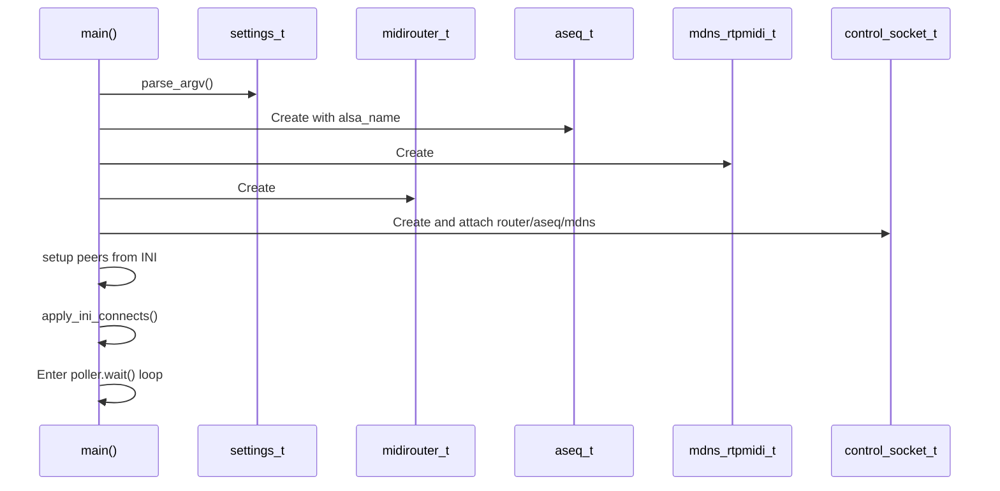
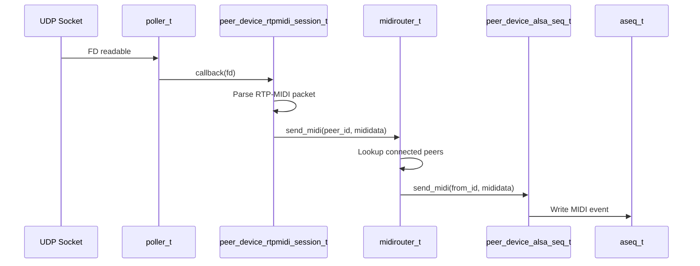
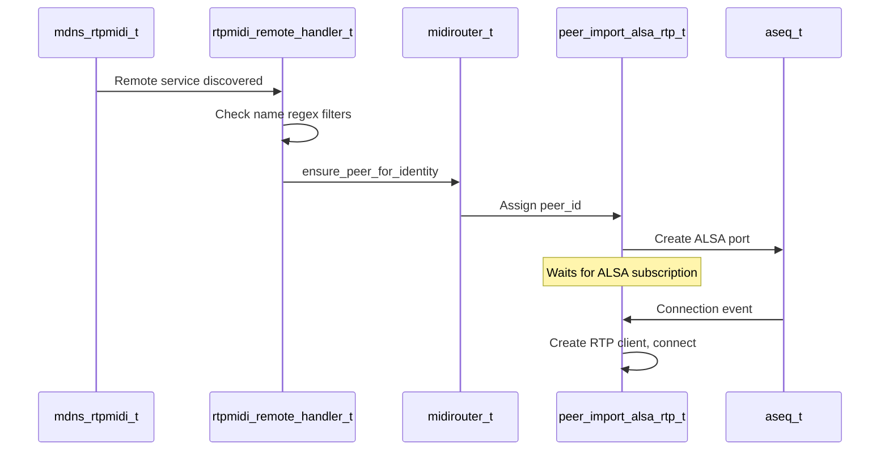
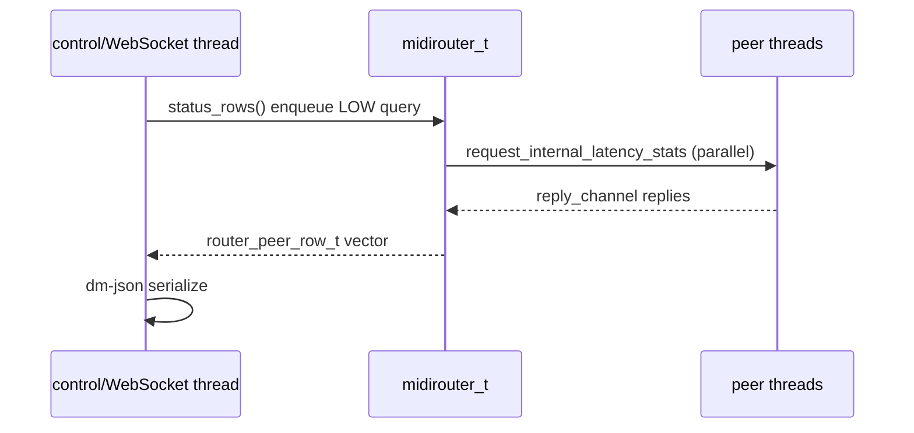

# Component interactions

Sequence diagrams for startup, MIDI routing, and discovery.

## Startup

INI peers created via `create_peer_from_string()`; connects via
`apply_ini_connects()` in [`src/peer_spawn.cpp`](../../src/peer_spawn.cpp).

## MIDI data flow (network → ALSA)

Encoding details: [midi-data-path.md](midi-data-path.md).

## mDNS discovery → connection

Lazy RTP connect: only when ALSA port is subscribed. See [discovery.md](discovery.md).

## Control plane read (status)

Status is control-plane only — not on the MIDI HIGH path.

## Related docs

- [components.md](components.md) — type reference
- [event-loop.md](event-loop.md) — threads and shutdown
- [concurrency.md](concurrency.md) — queue dispatch
