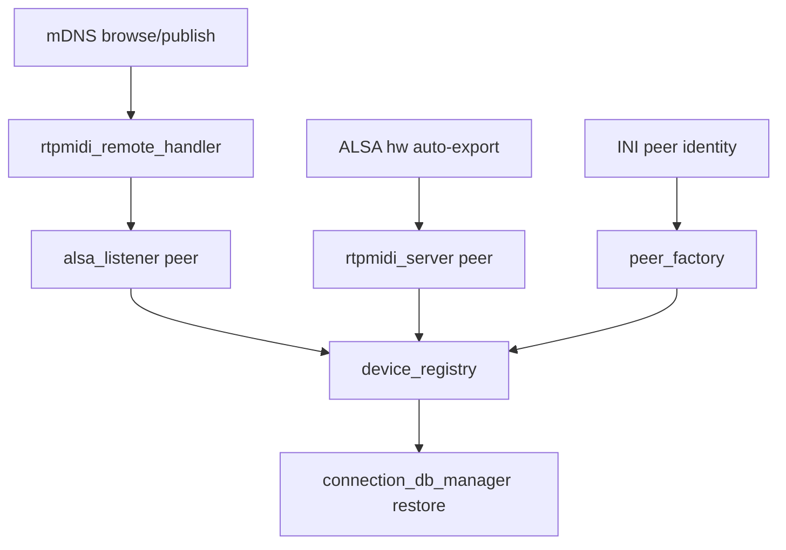

# Discovery and automatic peer creation

How rtpmidid learns about remote and local MIDI endpoints and turns them into
peers.

## mDNS (RTP-MIDI services)

[`lib/mdns_rtpmidi.cpp`](../../lib/mdns_rtpmidi.cpp) — Avahi-based browse/publish
for `_apple-midi._udp` services.

| Direction | Behavior |
|-----------|----------|
| **Publish** | `peer_export_rtpmidi_server_t`, `peer_export_alsa_network_t` children announce services |
| **Browse** | Discovers remote RTP-MIDI servers on the LAN |

Configuration: `[rtpmidi_discover]` in INI:

```ini
[rtpmidi_discover]
enabled=true
name_positive_regex=.*
name_negative_regex=^$
```

Negative regex is checked first; positive must also match.

## rtpmidi_remote_handler_t

[`src/rtpmidiremotehandler.cpp`](../../src/rtpmidiremotehandler.cpp) — reacts to
mDNS browse results:

1. Apply name regex filters from `settings.rtpmidi_discover`
2. For each accepted service, ensure an `alsa_listener` peer exists
3. Reuse existing peer if same remote name (`known_remote_peer_t` map)
4. Peer identity: `alsa_listener:service=…,hostname=…,port=…`

The RTP connection is **lazy** — `peer_import_alsa_rtp_t` opens the RTP client
only when something subscribes to the ALSA port.

## ALSA hardware auto-export

[`src/hwautoannounce.cpp`](../../src/hwautoannounce.cpp) — watches ALSA sequencer
for new hardware ports and auto-announces them as RTP services.

Configuration: `[alsa_hw_auto_export]`:

```ini
[alsa_hw_auto_export]
name_positive_regex=.*
name_negative_regex=(System|Timer|Announce)
type=hardware   # hardware | software | system | all | none
```

`type` filters which ALSA port types are exported.

## INI-declared peers

`[peer] identity=…` blocks create peers at startup via
`create_peer_from_string()` in `main.cpp`. Example:

```ini
[peer]
identity=rtpmidi_multi:name={{hostname}},port=5004
```

`{{hostname}}` is expanded at INI parse time.

## Spawn pipeline

Central helpers in [`src/peer_spawn.cpp`](../../src/peer_spawn.cpp):

| Function | When |
|----------|------|
| `ensure_peer_for_identity()` | Control RPC / restore — find or create peer |
| `spawn_import_rtpmidi_connection()` | New RTP session on multi-listener |
| `spawn_alsa_network_server()` | ALSA subscription on Network Export |
| `spawn_alsa_listener_client()` | ALSA subscription triggers RTP client |
| `apply_ini_connects()` | Wire `[connect]` edges at startup |

Factory: [`src/peer_factory.cpp`](../../src/peer_factory.cpp).

## Device registry integration

When a peer appears, `device_registry_t` (via router signals) records a
**discovered** device with `compute_device_identity()` from the peer's status
row. When the peer is removed, the device goes **offline** but stays in the
registry.

See [database.md](database.md) and [entities.md](entities.md).

## Connection auto-restore

When discovery brings a peer online, `connection_db_manager_t` runs
`plan_connection_restore()` to match saved query connections and create router
edges (or `aconnect` for pure ALSA pairs).

## Flow summary



## Related docs

- [peer-types.md](peer-types.md) — peer kinds created by discovery
- [entities.md](entities.md) — device sources
- [rtp-midi-networking.md](rtp-midi-networking.md) — protocol layer
