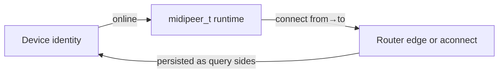

# Entities: Devices, Peers, and Connections

This document explains the three-level model used everywhere in rtpmidid: INI
files, the connection database, control RPC, and the Web UI.

## Overview



| Concept | What it is | Persisted? |
|---------|------------|------------|
| **Device** | A MIDI-capable endpoint with a stable identity string | Yes — `devices` table (registry) |
| **Peer** | Runtime `midipeer_t` in the router; may or may not map 1:1 to a device | No — ephemeral numeric `peer_id` |
| **Connection** | Directed link between two sides (router edge or ALSA `aconnect`) | Yes — `connections` table |

A device can exist **offline** in the registry (remembered but no active peer).
A peer always exists **online** while the daemon runs. Not every known device is
a peer at every moment (e.g. lazy `alsa_listener` opens RTP only on ALSA
subscription).

## Device identity grammar

Every endpoint is addressed by a single string:

```
type_prefix:key=value,key2=value2
```

- **Type prefix** selects the peer kind (see [peer-types.md](peer-types.md)).
- **Fields** are comma-separated `key=value` pairs.
- Values may need escaping for `:`, `,`, `=`, `[`, `]` (backslash escape).

Implementation: [`src/device_identity.hpp`](../../src/device_identity.hpp),
[`src/device_identity.cpp`](../../src/device_identity.cpp).

### Examples

```
alsa_seq:client=Peak,port=In
rawmidi:device=/dev/snd/midiC4D0,name=MIDI Export
rtpmidi_client:hostname=host.local,service=Peak Out,port=5004
rtpmidi_server:name=Peak InOut,port=5004
rtpmidi_multi:name={{hostname}},port=5004
alsa_multi:name=Network Export
alsa_listener:service=DeepMind12D,hostname=192.168.1.33,port=5004
```

`{{hostname}}` in INI values is replaced with `gethostname()` at parse time.

## Three levels of identity

### Identity (all fields)

Fully specifies one concrete device. Used for registry rows, peer creation, and
exact matching.

### Query (subset of fields)

Matches **all** online devices that satisfy the non-bracketed fields. Used for
fan-out restore and the connection editor.

```
rtpmidi_server:name=Peak            # any host, any port
alsa_seq:client=Peak                # both In and Out ports named Peak
```

Implementation: [`src/device_query.hpp`](../../src/device_query.hpp).

### Stored query (bracketed fields)

A query where some fields are **remembered** in `[brackets]` but **not** used for
matching. The UI toggles fields in/out of brackets.

```
rtpmidi_server:name=Peak,[port=5004]
alsa_seq:client=Peak,[port=In]
```

Bracketed fields are ignored by `device_query_t::matches()` but preserved in
the serialized string for display and later activation.

## Device sources

| Source | Meaning |
|--------|---------|
| `discovered` | Seen via mDNS, ALSA hw auto-export, or a live peer |
| `ini` | Declared in `[peer]` at startup |
| `manual` | Added via `devices.add_manual` or Web UI |
| `session` | Ephemeral peers (e.g. active RTP session) — UI tag only |

`online` is **not** stored in the DB; it is computed at runtime when a live peer
maps to the device identity.

## Peers

A **peer** is a `midipeer_t` instance managed by `midirouter_t`. Categories:

- **Device peers** — one-to-one with a concrete endpoint (`peer_device_*`)
- **Export peers** — expose local resources (`peer_export_*`)
- **Import peers** — accept outside connections; spawn children (`peer_import_*`)

See [peer-types.md](peer-types.md) for the full table.

Peers are created via:

- INI `[peer] identity=…` at startup
- mDNS discovery / hw auto-export (automatic)
- `router.create`, `connect`, `endpoint.connect` (control plane)
- Internal spawn when export/import listeners get a new connection

**Factory API** (`src/peer_factory.hpp`, `src/peer_factory.cpp`):

```cpp
peer_factory_context_t ctx{aseq, router, mdns};
create_peer_from_string("rawmidi:device=/dev/snd/midiC0D0", ctx, &err);
create_peer({identity, attachment, rtppeer, rtpclient, ...}, ctx, &err);
```

**Spawn recipes** (`src/peer_spawn.cpp`): `spawn_import_rtpmidi_connection`,
`spawn_alsa_network_server`, `spawn_alsa_listener_client`,
`ensure_peer_for_identity`, `apply_ini_connects`.

**Inverse helpers** (`src/device_identity_from_peer.hpp`):
`identity_from_rtppeer`, `identity_from_rtpclient_connect`,
`identity_from_alsa_names`, `compute_device_identity`.

**Cannot create from string alone:** `rtpmidi_session` (needs active RTP
attachment), `webui_monitor` (needs target peer + uuid).

Runtime-only types and creatable-from-string rules: [peer-types.md](peer-types.md).

## Connections

### Router connections (directed)

`midirouter_t::connect(from, to)` creates a **unidirectional** edge. MIDI from
`from` is forwarded to `to`. Bidirectional traffic requires two edges (or
`direction=both` in persistence, which restores two edges).

One peer can connect to many peers (N:M).

### Persisted connections

Stored in SQLite with:

| Column | Values |
|--------|--------|
| `side_a`, `side_b` | Stored-query identity strings |
| `direction` | `a2b`, `b2a`, `both` |
| `enabled` | `0` or `1` |

Restore expands query sides to all matching online peers and emits directed
`connect_action_t` edges. See [database.md](database.md).

### Pure ALSA connections

ALSA-seq ↔ ALSA-seq pairs use kernel `aconnect` (outside the router) for
latency. They still appear in the device/connection list and are restored via
`connection_alsa_direct.cpp`. Monitor during `aconnect` uses a transient router
tap (`alsa_monitor_tap.cpp`).

## Direction semantics

| Direction | Restore behavior |
|-----------|------------------|
| `a2b` | Connect `side_a` → `side_b` only |
| `b2a` | Connect `side_b` → `side_a` only |
| `both` | Both directions |

INI `[connect]` uses the same `direction` key (`a2b` / `b2a` / `both`; default
`both`).

## Related docs

- [peer-types.md](peer-types.md) — peer class reference
- [database.md](database.md) — persistence and auto-reconnect
- [discovery.md](discovery.md) — how devices appear
- [components.md](components.md) — midirouter and midipeer internals
