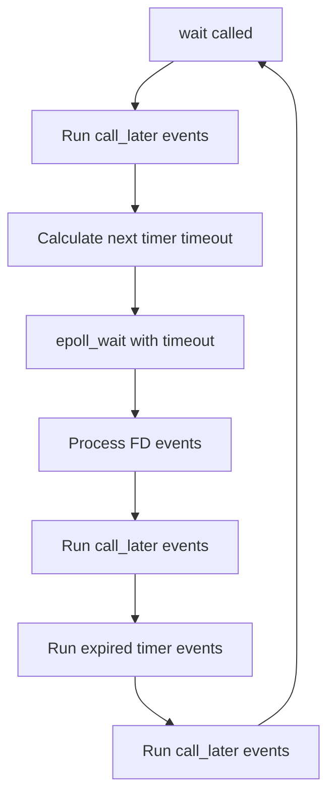

# Main event loop and threads

The daemon is **multi-threaded** with a **Linux epoll** main loop
(`rtpmidid::poller`) for real-time I/O. Blocking work runs on dedicated threads
so it does not stall unrelated peers.

## Thread inventory

| Thread | Role | Key files |
|--------|------|-----------|
| **Main / poller** | `epoll_wait`; UDP (`MSG_DONTWAIT`), ALSA sequencer FD, Avahi watches, DNS `eventfd`, `call_later` | `lib/poller.cpp`, `src/main.cpp` |
| **Router** | Sole owner of the peers map; drains `router_command_t` queue | `src/midirouter.cpp` |
| **Per peer** | One `std::thread` per `midipeer_t`; drains `peer_command_t` queue | `src/midipeer.cpp` |
| **DNS worker** | Blocking `getaddrinfo`; wakes poller via `eventfd` | `lib/dns_resolver.cpp` |
| **Control socket** | `poll()` + blocking I/O on Unix socket | `src/control_socket.cpp` |
| **Device registry** | Actor thread; owns `devices_` map | `src/device_registry.cpp` |
| **Cron tasks** | Periodic work (stale-device sweep) | `src/cron_tasks.cpp` |
| **Logger** | Drains lock-free log queue | `lib/logger.cpp` |

Actor model and queue primitives: [concurrency.md](concurrency.md).

## Poller main loop

```cpp
// src/main.cpp
while (rtpmidid::poller.is_open()) {
    rtpmidid::poller.wait();
}
```

### Event loop cycle



### Key poller methods

```cpp
listener_t add_fd_in(int fd, std::function<void(int)> callback);
timer_t add_timer_event(std::chrono::milliseconds ms, std::function<void()> callback);
void call_later(std::function<void()> callback);
void close();
```

Singleton: `rtpmidid::poller`. Level-triggered FD events; all FDs must be
non-blocking. Details: [concurrency.md](Concurrency.md#poller_t).

## Signal handling

`SIGINT` and `SIGTERM` use an async-signal-safe path: handler `write()`s to a
**shutdown eventfd** on the poller. The poller callback logs and calls
`poller.close()`.

- `block_shutdown_signals()` — mask signals in worker threads before they start
- `unblock_shutdown_signals()` — main/poller thread receives signals after setup
- Second signal re-raises default handler (`exit`)

Files: `include/rtpmidid/shutdown_signals.hpp`, `lib/shutdown_signals.cpp`.

## Shutdown order

`main_t::close()` (after poller loop exits):

1. Web server
2. `dns_resolver_shutdown()` — **before** stopping router/peer threads
3. Control socket
4. Remote handler
5. Hw auto-announce
6. Stop peer threads
7. Stop router thread
8. `remove_all_peers()` (RTP goodbyes, mDNS unannounce)
9. mDNS
10. ALSA
11. Router teardown

Per-actor shutdown is message-driven (`shutdown_t` on each queue). See
[concurrency.md](Concurrency.md#shutdown-pattern).

## Related docs

- [concurrency.md](concurrency.md) — queues, actors, reply channels
- [performance.md](performance.md) — what not to run on the poller thread
- [component-interactions.md](component-interactions.md) — startup sequence
