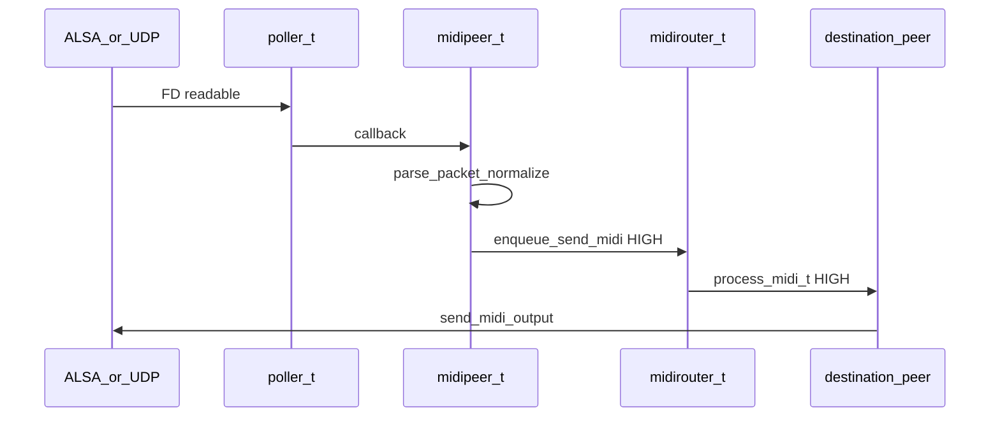

# MIDI data path

How MIDI bytes flow through encoding, normalization, and routing inside
rtpmidid.

## mididata_t

A **view** over raw MIDI bytes — no copy on the hot path.

[`src/mididata.hpp`](../../src/mididata.hpp) extends `rtpmidid::io_bytes_reader`:

```cpp
mididata_t(uint8_t *data, uint32_t size);
mididata_t(io_bytes_writer &writer);  // from writer buffer
mididata_t(const io_bytes_reader &reader);
```

Passed from router → peer `send_midi(from_id, data)` on the peer thread.

## io_bytes

[`include/rtpmidid/iobytes.hpp`](../../include/rtpmidid/iobytes.hpp):

| Type | Use |
|------|------|
| `io_bytes_reader` | Zero-copy read cursor over a buffer |
| `io_bytes_writer` | Dynamic grow buffer |
| `io_bytes_writer_static<N>` | **Stack-allocated** — preferred on hot path |

Example from `rtppeer_t::send_midi()`:

```cpp
io_bytes_writer_static<4096 + 12> buffer;  // no malloc
```

## RTP-MIDI packet layer

[`include/rtpmidid/rtpmidipacket.hpp`](../../include/rtpmidid/rtpmidipacket.hpp),
[`lib/rtpmidipacket.cpp`](../../lib/rtpmidipacket.cpp) — builds/parses the MIDI
command section inside RTP (B/J/Z/P flags, timestamps, journal bit).

[`include/rtpmidid/packet.hpp`](../../include/rtpmidid/packet.hpp) — generic
`packet_t` wrapper used by the normalizer.

Wire format reference: [RFC6295_notes.md](../reference/rfc6295-notes.md).

## midi_normalizer_t

[`src/midi_normalizer.cpp`](../../src/midi_normalizer.cpp) — stream normalizer for
ALSA ↔ network conversion:

- **Running status** collapse/expand
- **SysEx** reassembly across packet boundaries
- Invoked via `normalize_stream(packet, callback)` with per-packet callbacks

Uses `std::vector<uint8_t> m_buffer` (may reallocate on large SysEx — see
[performance.md](performance.md)).

## End-to-end flow



### Inbound (network → ALSA)

1. `udppeer` reads datagram (`MSG_DONTWAIT`)
2. `rtppeer` parses RTP-MIDI → raw MIDI events
3. Peer calls `enqueue_to_router()` → router HIGH queue
4. Router forwards to connected ALSA/raw peers
5. `peer_device_alsa_seq_t::send_midi()` writes `snd_seq_event_output`

### Outbound (ALSA → network)

1. ALSA sequencer FD on poller
2. `aseq_t` reads events → `mididata_t`
3. Peer normalizes → `rtppeer::send_midi()` → UDP

## Performance constraints

From [performance.md](performance.md) — avoid on the **poller thread**:

- `malloc`/`free`, `std::string` concat, disk/console I/O
- Blocking `getaddrinfo` (use `dns_resolver_t`)

Peer threads may block briefly on `snd_seq_drain_output()` or full UDP
buffers (`EAGAIN` + drop).

Optional compile-time timing: `-DRTPMIDID_ENABLE_TIMING=1` (CMake option
`RTPMIDID_ENABLE_TIMING`) adds per-packet `steady_clock` timestamps.

## Related docs

- [rtp-midi-networking.md](rtp-midi-networking.md) — RTP layer
- [overview.md](overview.md) — peer routing
- [performance.md](performance.md) — hot-path rules
- [event-loop.md](event-loop.md) — poller thread
