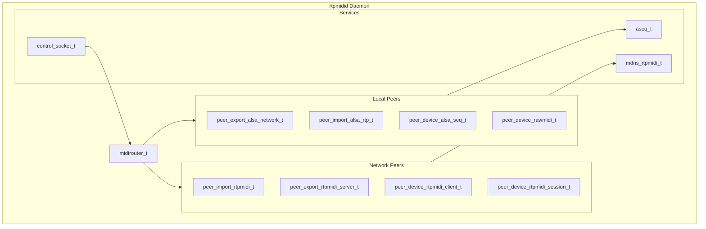

# Architecture

High-level notes on rtpmidi internal architecture.

## Peer-router pattern



### Design principles

1. **Peer abstraction** — every MIDI endpoint is a `midipeer_t`
2. **Unidirectional connections** — bidirectional needs two router edges
3. **Event-driven I/O** — non-blocking epoll multiplexing
4. **Identity-based factory** — `peer_factory.cpp` keyed on identity strings
5. **Shared ownership** — `std::shared_ptr`; router holds peer references

## `midipeer_t`

Internally, every MIDI endpoint — ALSA port, network socket, RTP session, raw
device — is a `midipeer_t`. Each has a specific role; they coordinate through
the central router.

All peers (`std::shared_ptr<midipeer_t>`) live in `midirouter_t`, which tracks
directed connections and routes MIDI from a source peer to its connected
destinations.

## Peer categories

Peers fall into three families:

| Family | Role | Examples |
|--------|------|----------|
| **Device peers** | One-to-one mapping to a concrete MIDI endpoint | `peer_device_alsa_seq_t`, `peer_device_rawmidi_t`, `peer_device_rtpmidi_client_t`, `peer_device_rtpmidi_session_t` |
| **Export peers** | Expose a local resource to the outside | `peer_export_alsa_network_t`, `peer_export_rtpmidi_server_t` |
| **Import peers** | Bring outside resources in; spawn child peers per connection | `peer_import_rtpmidi_t`, `peer_import_alsa_rtp_t` |

Internal-only: `webui_midi_monitor_peer_t` (Web UI monitor sink).

## Data flow (conceptual)

```
ALSA / raw / network I/O
        ↓
   midipeer_t (per-peer thread)
        ↓
   midirouter_t (router thread, HIGH-priority MIDI)
        ↓
   connected destination peer(s)
```

Export/import peers do not always carry MIDI themselves — they spawn and wire
child device peers. See [peer-types.md](peer-types.md) for the full table.

## Related docs

- [components.md](components.md) — midirouter, midipeer, aseq, mDNS, DNS
- [component-interactions.md](component-interactions.md) — startup and data-flow diagrams
- [entities.md](entities.md) — devices, identities, connections
- [peer-types.md](peer-types.md) — peer class reference
- [event-loop.md](event-loop.md) — threads and poller
- [concurrency.md](concurrency.md) — actor queues
