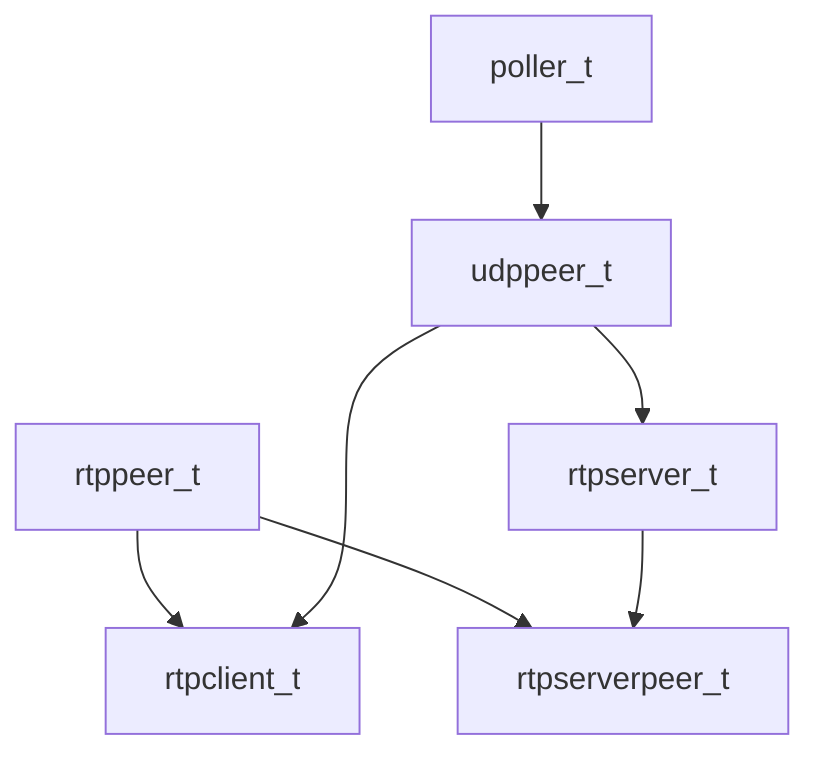

# RTP-MIDI networking layer

librtpmidid (`lib/`, `include/rtpmidid/`) implements the RTP-MIDI protocol.
The daemon builds peers on top of these classes.

Intro for library users: [README.librtpmidid.md](../README.librtpmidid.md).
Client state machine diagram: [lib/STATEMACHINES.md](../../lib/STATEMACHINES.md).
Packet format: [RFC6295_notes.md](../reference/rfc6295-notes.md).

## Class hierarchy



| Class | Role |
|-------|------|
| `poller_t` | epoll event loop (singleton `rtpmidid::poller`) |
| `udppeer_t` | Non-blocking UDP send/recv (`MSG_DONTWAIT`) |
| `rtppeer_t` | RTP-MIDI session protocol (invite, CK, MIDI, goodbye) |
| `rtpclient_t` | Outbound client: DNS resolve, connect, CK timers |
| `rtpserver_t` | Inbound listener on a UDP port |
| `rtpserverpeer_t` | Per-session server-side peer after invite accepted |
| `networkaddress_t` | Host/port resolution helpers |
| `dns_resolver_t` | Async `getaddrinfo` on worker thread |

Key files: `lib/rtppeer.cpp`, `lib/rtpclient.cpp`, `lib/rtpserver.cpp`,
`lib/rtpserverpeer.cpp`, `lib/udppeer.cpp`, `lib/dns_resolver.cpp`.

## rtppeer_t

Core protocol state machine. Subclasses implement `send_event()` to push bytes
onto the wire.

Typical flow (see `tests/test_rtppeer.cpp`):

1. Initialize local/remote SSRC, ports
2. Exchange invitation on control port, MIDI on data port
3. `send_midi()` builds RTP-MIDI packets; peer calls `send_event()`
4. Incoming data parsed → MIDI callback

`send_ck0` / clock synchronization handled by client state machine after
connect.

## rtpclient_t

Connects to remote servers. External API:

```cpp
client->add_server_address(address, port);
auto conn = client->peer.status_change_event.connect(callback);
```

Internally:

1. Resolve hostname (sync or via `dns_resolver_t`)
2. Try each resolved IP:port (control connect → MIDI connect)
3. On failure, try next address; externally appears as "connecting" then
   "connected" or timeout

State machine: [lib/STATEMACHINES.md](../../lib/STATEMACHINES.md).

### CK / clock dance

After connection (Apple MIDI compatibility):

- Send **6 CK0** packets at ~1.5 s intervals (short phase)
- Then send CK every **10 s** (long phase)
- Missing CK responses → disconnect (Mac OS / Tobias Erichsen clients require this)

Documented in [README.librtpmidid.md](../README.librtpmidid.md#ck0).

## rtpserver_t / rtpserverpeer_t

`rtpserver_t` listens on a UDP port. Each accepted invitation creates an
`rtpserverpeer_t` (server-side `rtppeer_t`). The daemon wraps these in
`peer_device_rtpmidi_session_t`.

## State machine codegen

`scripts/statemachine_to_cpp.py` parses `## state machine` sections in markdown
files and generates `*_statemachine.{hpp,cpp}`.

```bash
make statemachines
```

Currently generates `lib/rtpclient_statemachine.cpp` from
`lib/STATEMACHINES.md`. The generated code drives `rtpclient_t` transitions.

## mDNS integration

Service discovery is **not** in rtppeer — see [discovery.md](discovery.md).
`mdns_rtpmidi_t` (Avahi) announces and browses `_apple-midi._udp` services.

## DNS resolver

`rtpmidid::dns_resolver().resolve_async(host, port, callback)`:

- Worker thread runs blocking `getaddrinfo`
- Completion wakes poller via `eventfd`
- Callback resumes on poller thread (typically `poller.call_later`)

Shutdown: `dns_resolver_shutdown()` before stopping peer threads
(`main_t::close()`).

## Daemon mapping

| Daemon peer | lib class |
|-------------|-----------|
| `peer_device_rtpmidi_client_t` | owns `rtpclient_t` |
| `peer_device_rtpmidi_session_t` | wraps `rtpserverpeer_t` / `rtppeer_t` |
| `peer_import_rtpmidi_t` | owns `rtpserver_t` |
| `peer_export_rtpmidi_server_t` | owns `rtpserver_t` + mDNS announce |

## Related docs

- [midi-data-path.md](midi-data-path.md) — MIDI bytes inside RTP packets
- [discovery.md](discovery.md) — mDNS → peer spawn
- [performance.md](performance.md) — poller performance rules
