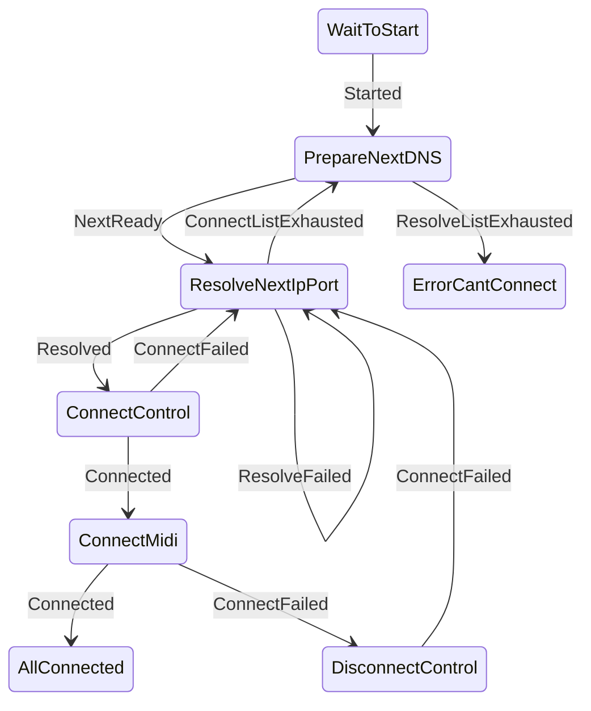

# rtpmidid::rtpclient_t

Can add `address:port` pairs and then try to connect to each of the resolved
hosts and port for each pair (can be in name:portname mode, and that could be
thousands of options, or at least several A and AAAA records).

Then for each real IP/IPv6 and port, try to create the local ports for that
protocol (IP or IPv6). Then sends the connect packet to the control port,
and on reception sends the connect to midi. When received the answer, then
the connection is made. If any of these fail, try next ip:port. If all ip:port
fails for this address, try next addres. And if all these fail, then we
really failed.

Externally we can be ready, connecting or connected. No failure should be knopwn
by users of this class. At most it will take some time or fail.

External interface is resumed:

```c++
client->add_address(address, port);
client->add_address(address2, port);
client->connected.connect(callback_when_connected_or_fail);
client->connect_failed.connect(callback_when_connect_fails);
client->connect();
```

And then use the `client->peer` as needed.

## state machine

States:

- WaitToStart
- PrepareNextDNS
- ResolveNextIpPort
- ConnectControl
- ConnectMidi
- DisconnectControl
- AllConnected
- ErrorCantConnect

Events:

- Started
- NextReady
- Connected
- ConnectListExhausted
- ResolveListExhausted
- ConnectFailed
- ResolveFailed


